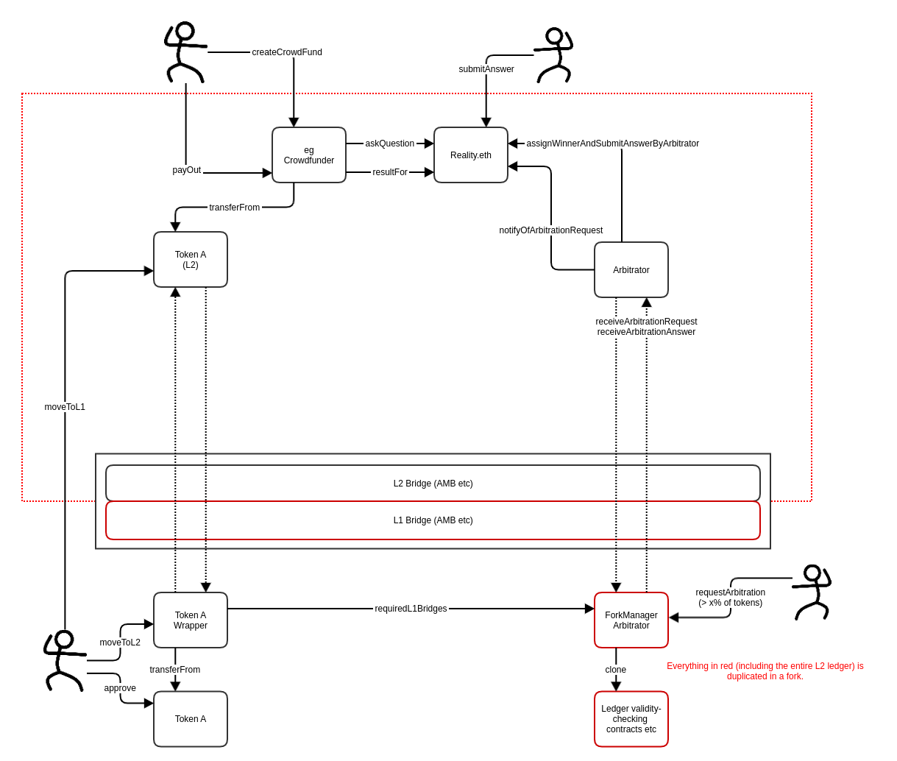
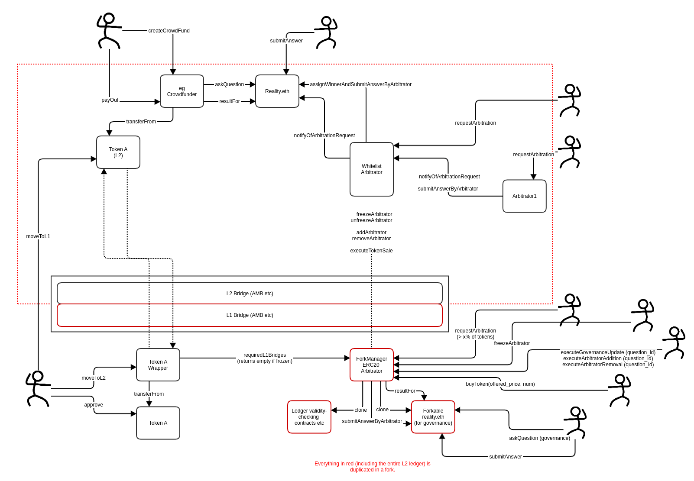

# The Borg

### Branching Oracle-enshrined Rollup Governance 

### Edmund Edgar, 2021-03-16

## Summary

We propose a design for handling forking layer-2 ledgers to provide a trust anchor for oracles and, optionally, governance allowing upgrades of the layer-2 system. It provides "subjectivocratic" security for assets issued on the ledger, and secures assets from the layer-1 ledger, albeit with an economic security bound. 

## Enshrining oracles

Last year [Justin Drake made a proposal to ethresear.ch for price feeds to be "enshrined" in the Ethereum 2 chain](https://ethresear.ch/t/enshrined-eth2-price-feeds/7391). Some people made the reasonable objection that "enshrining" additional data in the base layer increases the number and type of things that the chain has to come to consensus about, increasing the risk of a network split. This therefore seems inappropriate as a feature of the base Ethereum ledger. However, there are clear benefits to "enshrining" access to real-world data in the rules of a chain. The ability to fork the entire ledger in the case of controversy has proven effective at allowing an "honest" protocol to survive. This "subjectivocratic" property, [discussed by Vitalik Buterin his piece in 2015 on the subjectivity-exploitability tradeoff](https://blog.ethereum.org/2015/02/14/subjectivity-exploitability-tradeoff/), allows honest users to continue operation using an "honest" version of the ledger even if proof-of-work or proof-of-stake or any "objective" system they are using is attacked. This in turn avoids the systems being subject to a strict security bound, where handling funds greater than the economic security that is protecting them makes them profitably exploitable.

There have been attempts to recreate this "subjective" property on top of an existing L1 ledger. Augur goes partway down this route, [forking itself into two in the case of controversy](https://whitepaper.io/document/29/augur-whitepaper). However since the tokens Augur users use to bet are tokens like ETH and DAI that it cannot cause to fork, the "subjective" protection is limited to holders of their native token. This in turn means that their system cannot safely handle more value than a fraction of the total market cap of their governance token. An alternative system could attempt to get subjectivocratic security by making tokens representing other assets on the chain also be forkable, but in practice this tends to reduce composibility and propagate complexity through any other contract that would need to handle a token that may fork.

We describe a design that combines an escalation game (here, [reality.eth](https://reality.eth.limo)) with a forking L2 ledger in a way that provides an on-chain root of trust for oracle data to support applications on it, and also, optionally, be used to govern the L2 system itself.

## Forking L2 systems

L2 designs typically have a separate ledger, connected to the L2 system by a contract performing the role of a message bridge and often anchored by another contract handing data used for validity proofs and other requirements specific to the L2 system in question.  To bridge assets from the L1 world, you would typically use contracts on the L1 chain in which assets are locked, prompting a message to be sent to their counterparts on the L2 chain, which in turn mints equivalent tokens on the L2 chain. A message sent in the opposite direction can prompt assets to be unlocked, having confirmed that they have been burned on the L2 ledger. 

You could fork a conventional L2 chain by cloning its L2 ledger, and publishing new L1 versions of a new message bridge, along with any contracts related to validity proofs etc. This will create a parallel chain, with all the assets issued on the original chain duplicated. The forked L2 ledgers can be identical, except that as of the date of the fork they should each now commit to new L1 contracts, and receive messages from a new L1 message bridge.

If assets are locked up in contracts on the L2 chain such that nobody has permission to simply withdraw them and redeposit them on the new L2 chain, these unforkable asset bridges need a way to learn that they should rely on messages from the new bridge contract instead of the old one.

In our design we keep track of the forking with a contract which we call the Fork Manager. This is effectively a Token-Curated Registry managing which Message Bridge contract you should talk to when you want send messages to or from the L2 ledger. In the event of a fork, the Fork Manager clones itself into two copies and uses a governance process similar to Augur, requiring token holders to move their tokens to one or the other of the forks. The fork which attracts the most tokens is considered the "recommended" fork. During the dispute period where tokenholders are moving their tokens, an L1 contract should only redeem assets if given an identical instruction by both forks, ie if the assets in question are not involved in anything that the two rival ledgers disagree about. Once the dispute period is complete, it should redeem assets based on the instructions of the "winning" fork. 

## Sidestepping the unforkable asset security bound

As we discussed earlier, unlike chain-native assets, which can be duplicated on both forks and therefore benefit from full "subjectivocratic" security, unforkable assets are subject to an economic security bound: They are only as secure as the ratio of goverance token value to the value of unforkable assets that are being secured. If the value of unforkable assets is high relative to the value of the governance tokens used by the TCR, an attacker may buy governance tokens and use them to direct assets following the "winning" fork to a malicious ledger, or bribe existing tokenholders to do the same.

Note that handling "locked" assets is the only place in this design where the notion of a "winning" fork is important. In all other respects, users can use whichever of the competing ledgers they consider committed to the correct worldview. The design also allows for bridges using other mechanisms; For instance, many alternate L1 systems simply use a multisig of trusted parties to maintain a bridge, and applying a setup like this to the more limited problem of choosing only between competing forking ledgers would be strictly more secure than a system where such a multisig had complete control over the assets in question.

It is also possible to create contracts on the L2 chain that use forkable, L2-native collateral to insure against the possibility of your assets ending up on the losing side of a fork. This insurance will be unable to pay out on a forked ledger which is considered completely worthless, as the collateral will also be worthless. But in the case of an attack, where governance tokens have been bought up with the aim of stealing unforkable assets of greater value, the collateral on the "losing" chain should still be valuable, and provided it has been adequately collateralized, the insurance will be able to pay out. So although ETH and USD-pegged assets and other tokens representing unforkable things from the L1 chain do not benefit from "subjectivocratic" security, we can create synthetic assets that do.

## Applying forking to Oracle Governance

In theory this process can be used for any goverance-related decision, including routine upgrades of L2 systems. You can import the state of the old ledger into the new ledger, start operating under the new rules, and use a TCR to inform contracts mediating with the L1 chain that they should now talk to the new contracts when they want to send or receive messages to or from the L2 chain. Users will use whichever ledger they think is legitimate and value the assets on that ledger, and contracts handling unforkable L1 assets will use the chain they were told to use by the TCR.

But here, we use it to govern decisions by enshrined oracles. Each ledger brings with it an implicit commitment to a set of facts about the world. If there is a dispute about the correct truth about the world, we fork the ledger and allow users to choose whichever ledger they think is correct.

Since forking the entire ledger is expensive, we handle routine cases with [reality.eth](https://reality.eth.limo). Reality.eth [uses an escalation game](https://reality.eth.limo/app/docs/html/whitepaper.html) where anyone can make a claim by posting a bond, which can in turn be rejected by another user by doubling the bond, then reasserted by doubling the bond again, etc. The escalation game is backstopped by a contract we call an "arbitrator", which, for a fee, will make a final judgement. The escalation game is designed such that you should normally only need to call the arbitrator in exceptional cases, so it is acceptable for arbitration to be slow and socially expensive. Arbitration can also be financially expensive, as the "right" party can escalate until they stand to make a profit from the "wrong" side (ie the side the arbitrator rules against) in excess of the fee they will need to pay for arbitration.

A reality.eth instance on the L2 ledger can be asked questions, and these questions can be escalated to the Fork Manager in case of dispute. The cost of arbitration by the Fork Manager can be set at a level where the escalation will only happen in unusual cases. An escalation over whether or not X happened will create a fork, where the Fork Manager will tell one ledger that X happened and the other ledger that X did not happen. Users are free to use whichever fork they consider most useful, likely the one that reflects the true state of the world.

Once its fee has been paid calling on it to arbitrate, the Fork Manager contract forks the ledger into two, one representing each possible result for the question it has been asked. It immediately notifies the reality.eth instance on each fork of the result of arbitration: On one fork one option is considered to have been chosen, and on the other fork the other is considered to have been chosen. This means that people who posted bonds on each respective side of the dispute have "won", but only in tokens premised on the idea that they are correct.

## Adding oracle indirection

Although the escalation process should make forks unusual, we propose adding an additional layer of indirection between questions put to an oracle and the forking process. This can be done by forking not over individual questions but over a whitelist of arbitrators. Instead of forking over "Did X happen", we let a standard arbitrator answer the question in the first instance, then fork over whitelist membership such as "Should we start trusting Arbitrator Y" or "Should we stop trusting Arbitrator Z"? If the arbitrator that has attempted to answer the question is found to be untrustworthy (from the point of view of the version of the ledger it lives on) it is removed from the whitelist and the question made available for another arbitrator still on the whitelist to answer.

The contract representing the arbitration whitelist can charge fees in any token, but pays any tokens it collects to governance token holders by auctioning its balance to them in exchange for governance tokens, which it burns.

## Adding other governance features

In principle the same process can be adapted to handle other upgrades of the system, based on technical changes. This may be necessary to the extent that the underlying L2 system is not considered sufficiently mature to run without the need for upgrades. However, governance features often present opportunities to steal a much greater proportion of the "unforkable" assets controlled by a system than a single whitelisted oracle, so the ratio at which such assets become unsafe is potentially lower than with enshrined oracles. A system that does not need to be upgraded and only uses the forking process to govern its enshrined oracles will therefore be able to support more such assets safely than one which shares the process to allow arbitrary upgrades.

If the L2 system and its ability to get messages to L1 is not trusted, we need a forkable instance of reality.eth on L1 to handle governance. This differs from the standard reality.eth in that it has a record of its parent, and can be made to import questions from the parent. On forking, the fork manager will transfer the balance held by the parent reality.eth instance to the two child instances before notifying each of its respective result. Users can import their questions to the child instances to claim any funds they are owed.

If either the L2 system or the bridge on L1 is not trusted, contracts relying on it to unlock funds on L1 will need a timeout to allow the governance process to be used to freeze it in case of misbehaviour, and potentially replace it.

## Prototype implementation

The interactions between users and contracts are specified in detail in [interactions](interactions.md).

The system is implemented in the following contracts (and their dependencies such as existing reality.eth contracts):

* [ForkManager.sol](development/contracts/ForkManager.sol) implements the governance token and fork management.
* [ForkableRealityETH_ERC20.sol](development/contracts/ForkableRealityETH_ERC20.sol) is a modified version of reality.eth designed to be used only for governance and/or arbitrator selection.
* [RealityETH_ERC20-3.0.sol](development/contracts/RealityETH_ERC20-3.0.sol) is the preexisting reality.eth contract that would be deployed on Layer 2.
* [WhitelistArbitrator.sol](development/contracts/WhitelistArbitrator.sol) is an arbitration contract based on a whitelist managed by the ForkManager.
* [TokenBridge.sol](development/contracts/TokenBridge.sol) is an example of how a token on Layer 1 would follow the direction of the ForkManager in locking assets to be credited on Layer 2 and unlocking them based on messages from the appropriate Layer 2 bridge. Untrusted bridges may instead require a [DelayedTokenBridge.sol](development/contracts/DelayedTokenBridge.sol).

Tests for the above are in [tests/python/test.py](tests/python/test.py).

## Next steps

- We need to select an L2 system to build a prototype. See [L2 choices](l2_choice.md).
- Someone needs to distribute governance tokens, and potentially handle any funds resulting from the sale, possibly one of the DAOs that currently uses reality.eth.

## Discussion

* [Discord](https://discord.gg/8ETpnUH)
* [ethresear.ch](https://ethresear.ch/t/branching-oracle-enshrined-rollup-governance/9552)
